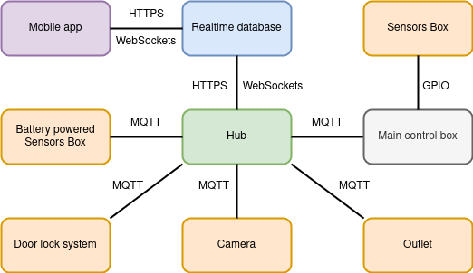
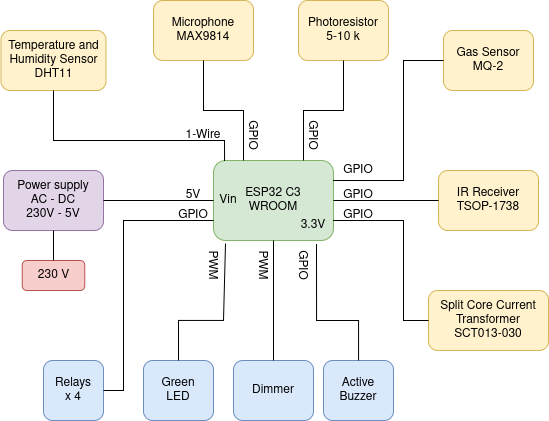

# 🏠 HomeControl Box – Smart Home Automation System

**HomeControl Box** is a modular, extensible smart home system designed for monitoring and control of a house using a [mobile application](https://github.com/Dragosh-C/Smart-Home-App) and a set of interconnected IoT devices. Developed with a focus on personalization, automation, and real-time responsiveness, the system integrates sensors, actuators, cameras, and smart locks through a centralized hub and a Kotlin-based Android app.

---

## 🚀 Key Features

- ✅ **User Personalization:** Profiles, rooms, and preferences saved per user
- 🔐 **Secure Access:** Login with Google Authentication or password
- 🧭 **Room Management:** Create and organize rooms with widgets
- 📈 **Real-Time Monitoring:** Track temperature, humidity, light, gas, air quality, power, water leakage, and battery levels
- 💡 **Device Control:** Remotely manage sockets, lights, outlets, and appliances
- 🔒 **Smart Lock System:** Access using password, RFID or mobile app
- 📷 **Camera Integration:** Live view and control in the mobile app
- 🔁 **Routine Automation:**
  - Based on sensor data
  - Based on user location or context
  - Time-based and adaptive wake-up alarms
- 🕹️ **IR Remote Control Support** Control lights and devices using remote
- 👏 **Clap Detection Automation** Control lights and devices
- 🚨 **Intrusion Detection:** Using hall effect sensors on doors/windows
- 📳 **Push Notifications:** Alert on poor air quality, gas leak, intrusions, water leak etc.
- 📊 **Visual Statistics:** Graphs for data by day/week/month/year
- 🔧 **Modular & Scalable:** Easy to add new devices or sensors

---

## 🧱 System Architecture




The system includes the following core components:

### 📱 Android Mobile App
### Link to the app repo:  https://github.com/Dragosh-C/Smart-Home-App
- Developed using **Kotlin** and **XML**
- Interfaces with Firebase for data sync and authentication
- Provides a graphical dashboard, control panel, and automation manager

### 🧠 Central Hub
- **Raspberry Pi 5** acting as the MQTT broker and system coordinator
- Manages communication between ESP32 devices and Firebase
- Handles automation routines and as a local database for sensors (InfluxDB)

### 📡 IoT Device Nodes
- Based on **ESP32** microcontrollers
- Equipped with various sensors and actuators:
  - DHT11 (temperature/humidity)
  - MQ2 (gas and air quality)
  - Photoresistor (light)
  - Hall sensor (doors/windows)
  - Water leakage sensors
  - Microphone (for clap detection)
  - Relay modules, IR transmitter, LEDs, and servos
- Housed in **heat-resistant enclosures** for safety

**Diagram for main Box:**



### 🔗 Communication Protocols
- **MQTT**: Lightweight, low-latency messaging between hub and devices
- **Firebase Realtime Database**: For real-time data updates and app communication
- **Cloud Firestore**: Structured NoSQL database for storing user data, preferences, automation, and device configurations

---

## 🔐 Security and Privacy

- Communication is encrypted
- Device-to-hub MQTT messaging uses secure certificate-based TLS
- Authentication via Firebase GoogleAuth and email/password
- User-specific access and configuration

---

## 📦 How to Get Started

### Prerequisites
- Raspberry Pi 5 with Raspbian OS
- ESP32 (multiple nodes)
- Android Studio
- Firebase project set up (Realtime DB, Firestore, Authentication)

### Steps

1. **Clone ESP-IDF:**
   ```bash
   git clone --recursive https://github.com/espressif/esp-idf.git
   cd esp-idf
   ```
2. **Install dependencies and toolchain:**

       ./install.sh

3. **Set up environment:**

        ./export.sh

4. **Build and flash**: for each device individually
   ```bash
      idf.py build
      idf.py -p /dev/ttyACM0 flash 
   ```

## Firmware components 

| Folder              | Description                                      |
| ------------------- | ------------------------------------------------ |
| `main_box/`         | Device for monitoring power usage and control    |
| `rpi_hub/`          | Contain code for hub                             |
| `camerabox/`        | ESP32-CAM module for live video                  |
| `lock-system/`      | Door lock device                                 |
| `sensors_box_type/` | Device for monitor environment                   |
| `smart_outlet/`     | Controllable outlet unit                         |


